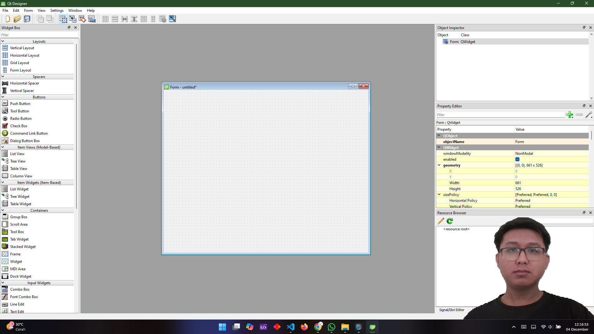
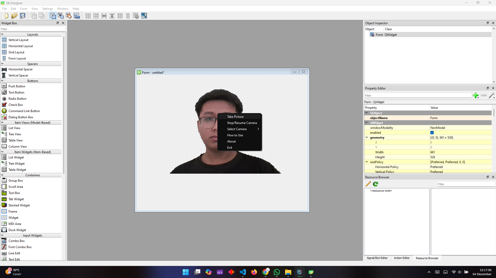
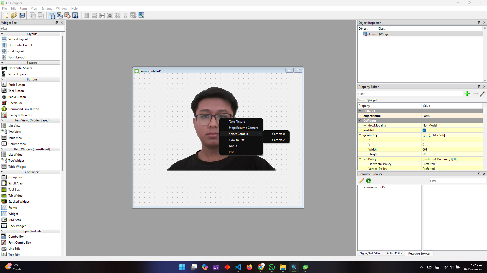

  

# StreamCam

StreamCam is a powerful desktop application designed to enhance your streaming experience by overlaying your webcam feed over your desktop screen. Ideal for streamers, gamers, and content creators, StreamCam provides a seamless integration of webcam streams, including background removal, and easy camera switching features.

## Features

- **Live Streaming with Webcam Overlay**: Seamlessly overlay your webcam feed during your streaming or recording sessions.
- **Background Removal**: Automatically removes the background from your webcam feed to enhance your visual presence.
- **Camera Controls**: Pause, resume, and switch between available cameras easily.
- **Capture Pictures**: Capture still images from your webcam feed.
- **Customizable Interface**: Intuitive interface with right-click context menu for quick actions like switching cameras and more.
- **No Window Frame**: The app has no window frame and stays always on top for easy access while streaming.

## Screenshoot
Here are some screenshots of the application in action:

## Installation

To get started with StreamCam, follow these steps:

1. **Download**: Go to the [Releases Page](https://github.com/Arifmaulanaazis/StreamCam/releases) to download the prebuilt Windows version of the application.
2. **Extract**: Once the ZIP file is downloaded, extract the contents to a folder on your computer.
3. **Run the Application**: Open the extracted folder and double-click the `StreamCam.exe` file to launch the application.

## How to Use

- **Right-click** anywhere in the StreamCam window to open the context menu with various options:
  - **Take Picture**: Capture and save an image of your webcam feed.
  - **Stop/Resume Camera**: Toggle the webcam on or off.
  - **Select Camera**: Switch between available connected cameras.
  - **Background Removal**: Toggle the background removal feature.
  - **How to Use**: Open a dialog with usage instructions.
  - **About**: Display version and developer information.
  - **Exit**: Close the application.

## Troubleshooting

If you encounter any issues, try the following:

- Ensure your camera is properly connected and accessible.
- Try restarting the application if the webcam feed doesn't show.
- For further assistance, please check the [Issues Page](https://github.com/Arifmaulanaazis/StreamCam/issues).

## License

StreamCam is released under the [MIT License](LICENSE).

## Contact

- **GitHub**: [Arifmaulanaazis](https://github.com/Arifmaulanaazis)
- **Instagram**: [@arif_maulana_19](https://www.instagram.com/arif_maulana_19/)
- **YouTube**: [@arif_maulana_19](https://www.youtube.com/@arif_maulana_19)
- **Facebook**: [Arif Maulana Azis](https://www.facebook.com/ArifMaulanaAzis19)
